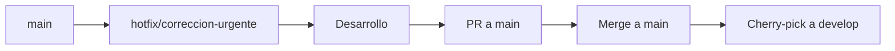

# Estrategia de Git - FoodOffice

## 📋 Índice
1. [Modelo de Branching](#modelo-de-branching)
2. [Flujo de Trabajo](#flujo-de-trabajo)
3. [Convenciones de Commits](#convenciones-de-commits)
4. [Pull Requests](#pull-requests)
5. [Protección de Ramas](#protección-de-ramas)
6. [Mejores Prácticas](#mejores-prácticas)

---

## 🌳 Modelo de Branching

### Ramas Principales

#### `main` (Producción)
- **Propósito**: Código en producción, siempre estable y desplegado
- **Protección**: Requiere PR, aprobación de revisores, y todos los checks deben pasar
- **Merge**: Solo desde `staging` después de pruebas exhaustivas
- **Deploy**: Automático a producción

#### `staging` (Pre-producción)
- **Propósito**: Ambiente de staging para pruebas finales antes de producción
- **Protección**: Requiere PR, aprobación de revisores
- **Merge**: Desde `develop` o `main` (hotfixes)
- **Deploy**: Automático a staging

#### `develop` (Desarrollo)
- **Propósito**: Rama de integración para desarrollo activo
- **Protección**: Requiere PR, pero con menos restricciones que `main`
- **Merge**: Desde feature branches
- **Deploy**: Automático a desarrollo

### Ramas de Soporte

#### Feature Branches (`feature/*`)
- **Formato**: `feature/NOMBRE-DESCRIPTIVO` o `feature/TICKET-NUMERO-descripcion`
- **Ejemplos**:
  - `feature/add-user-authentication`
  - `feature/FO-123-implement-login`
- **Origen**: Siempre desde `develop`
- **Destino**: Merge a `develop` vía PR
- **Lifespan**: Eliminada después del merge

#### Hotfix Branches (`hotfix/*`)
- **Formato**: `hotfix/DESCRIPCION-CORTA` o `hotfix/TICKET-NUMERO-descripcion`
- **Propósito**: Correcciones urgentes para producción
- **Origen**: Desde `main`
- **Destino**: Merge a `main` y `develop` (cherry-pick si es necesario)
- **Ejemplo**: `hotfix/FO-456-fix-security-vulnerability`

#### Release Branches (`release/*`)
- **Formato**: `release/vX.Y.Z` o `release/YYYY-MM-DD`
- **Propósito**: Preparación de releases, versionado, changelog
- **Origen**: Desde `develop`
- **Destino**: Merge a `main` y `develop`
- **Ejemplo**: `release/v1.2.0`

---

## 🔄 Flujo de Trabajo

### Desarrollo de Features


**Pasos detallados:**

1. **Crear feature branch**
   ```bash
   git checkout develop
   git pull origin develop
   git checkout -b feature/mi-nueva-funcionalidad
   ```

2. **Desarrollo y commits**
   - Hacer commits frecuentes y descriptivos
   - Seguir convenciones de commits (ver sección siguiente)
   - Push regularmente para backup

3. **Crear Pull Request**
   - Título descriptivo
   - Descripción clara del cambio
   - Referencias a tickets/issues
   - Screenshots si aplica

4. **Code Review**
   - Esperar aprobación de al menos 1 revisor
   - Resolver comentarios
   - Todos los checks de CI/CD deben pasar

5. **Merge**
   - Usar "Squash and merge" para mantener historial limpio
   - Eliminar branch después del merge

### Hotfix Flow



**Pasos:**

1. Crear branch desde `main`
2. Implementar fix
3. PR a `main` (prioridad alta)
4. Después del merge, cherry-pick a `develop` si aplica

---

## 📝 Convenciones de Commits

### Formato

```
<tipo>(<ámbito>): <descripción corta>

[descripción opcional más detallada]

[footer opcional con referencias a issues]
```

### Tipos de Commits

- **feat**: Nueva funcionalidad
- **fix**: Corrección de bug
- **docs**: Cambios en documentación
- **style**: Cambios de formato (no afectan código)
- **refactor**: Refactorización de código
- **test**: Agregar o modificar tests
- **chore**: Tareas de mantenimiento (deps, config, etc.)
- **perf**: Mejoras de rendimiento
- **ci**: Cambios en CI/CD
- **build**: Cambios en sistema de build
- **terraform**: Cambios específicos de Terraform

### Ámbitos (Opcional)

- `frontend`: Cambios en frontend
- `backend`: Cambios en backend
- `terraform`: Cambios en infraestructura
- `api`: Cambios en API
- `auth`: Cambios en autenticación
- `ui`: Cambios en UI/UX

### Ejemplos

```bash
# Feature
feat(auth): agregar login con OAuth2

# Fix
fix(api): corregir error 500 en endpoint de productos

# Terraform
terraform(infra): agregar security group para RDS

# Docs
docs(readme): actualizar instrucciones de instalación

# Con referencia a issue
fix(frontend): corregir bug en formulario de login

Closes #123
```

### Reglas

- ✅ Usar imperativo ("agregar" no "agregué")
- ✅ Primera línea máximo 72 caracteres
- ✅ Descripción clara y específica
- ✅ Referenciar issues/tickets cuando aplique
- ❌ No usar commits genéricos como "update" o "fix"

---

## 🔀 Pull Requests

### Requisitos para PR

1. **Título descriptivo**
   - Formato: `[TIPO] Descripción breve`
   - Ejemplo: `[FEAT] Agregar autenticación con Google OAuth`

2. **Descripción completa**
   - Qué cambia y por qué
   - Cómo probar
   - Screenshots si aplica
   - Checklist de validación

3. **Template de PR** (recomendado)
   ```markdown
   ## Descripción
   [Descripción del cambio]
   
   ## Tipo de cambio
   - [ ] Bug fix
   - [ ] Nueva funcionalidad
   - [ ] Breaking change
   - [ ] Documentación
   
   ## Cómo probar
   [Instrucciones para probar]
   
   ## Checklist
   - [ ] Código sigue estándares del proyecto
   - [ ] Tests agregados/actualizados
   - [ ] Documentación actualizada
   - [ ] Sin errores de lint
   - [ ] Build exitoso
   ```

4. **Validaciones automáticas**
   - ✅ Todos los tests pasan
   - ✅ Lint sin errores
   - ✅ Build exitoso
   - ✅ Terraform validate exitoso
   - ✅ Sin conflictos con base branch

### Proceso de Review

1. **Autor del PR**
   - Asignar revisores apropiados
   - Responder a comentarios
   - Hacer cambios solicitados
   - Marcar como "Ready for review" cuando esté listo

2. **Revisores**
   - Revisar código en 24-48 horas
   - Comentarios constructivos y específicos
   - Aprobar solo si está listo para merge
   - Solicitar cambios si hay problemas

3. **Merge**
   - Solo después de aprobación
   - Todos los checks deben pasar
   - Preferir "Squash and merge" para feature branches
   - "Merge commit" solo para releases importantes

---

## 🛡️ Protección de Ramas

### Configuración Recomendada

#### `main` (Producción)
- ✅ Requiere PR para merge
- ✅ Requiere aprobación de al menos 2 revisores
- ✅ Requiere que todos los checks pasen
- ✅ Requiere que esté actualizada con base branch
- ✅ No permite force push
- ✅ No permite eliminar branch
- ✅ Requiere linear history (opcional pero recomendado)

#### `staging`
- ✅ Requiere PR para merge
- ✅ Requiere aprobación de al menos 1 revisor
- ✅ Requiere que todos los checks pasen
- ✅ No permite force push

#### `develop`
- ✅ Requiere PR para merge
- ✅ Requiere aprobación de al menos 1 revisor
- ✅ Requiere que checks básicos pasen
- ⚠️ Permite force push solo para maintainers (con precaución)

---

## 💡 Mejores Prácticas

### General

1. **Pull frecuentemente**
   ```bash
   git pull origin develop --rebase
   ```

2. **Commits pequeños y frecuentes**
   - Un commit = un cambio lógico
   - Facilita review y rollback

3. **Mantener branches actualizados**
   ```bash
   git checkout develop
   git pull origin develop
   git checkout feature/mi-feature
   git rebase develop
   ```

4. **Usar rebase para limpiar historial** (antes de PR)
   ```bash
   git rebase -i HEAD~3  # Interactivo para últimos 3 commits
   ```

5. **No hacer commit de archivos sensibles**
   - `.env`, `secrets`, credenciales
   - Verificar `.gitignore`

### Resolución de Conflictos

1. **Actualizar branch antes de resolver**
   ```bash
   git checkout feature/mi-feature
   git pull origin develop --rebase
   ```

2. **Resolver conflictos manualmente**
   - Entender ambos cambios
   - Mantener funcionalidad de ambos si es posible
   - Probar después de resolver

3. **Continuar rebase**
   ```bash
   git add .
   git rebase --continue
   ```

### Git Hooks (Opcional pero recomendado)

Crear `.git/hooks/pre-commit`:
```bash
#!/bin/sh
npm run lint
npm run check
```

---

## 📚 Recursos Adicionales

- [Conventional Commits](https://www.conventionalcommits.org/)
- [Git Flow](https://nvie.com/posts/a-successful-git-branching-model/)
- [GitHub Flow](https://guides.github.com/introduction/flow/)

---

## ❓ Preguntas Frecuentes

**P: ¿Puedo hacer commit directo a `develop`?**
R: No, siempre usar PRs para mantener trazabilidad.

**P: ¿Qué hacer si necesito hacer un cambio urgente en producción?**
R: Usar hotfix branch desde `main`, seguir el hotfix flow.

**P: ¿Cuánto tiempo mantener feature branches?**
R: Idealmente menos de 1 semana. Si toma más tiempo, dividir en PRs más pequeños.

**P: ¿Qué hacer si mi PR tiene muchos commits?**
R: Usar squash merge o hacer rebase interactivo para limpiar historial.

---

**Última actualización**: 2024
**Mantenedor**: Equipo de Desarrollo FoodOffice
